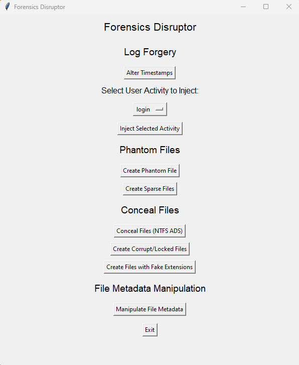
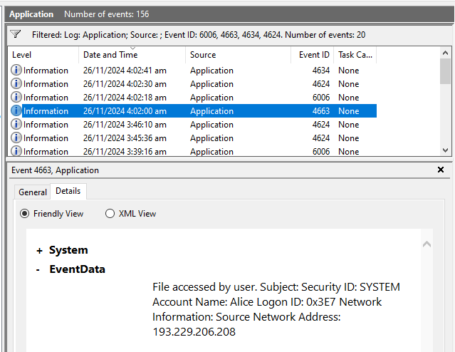
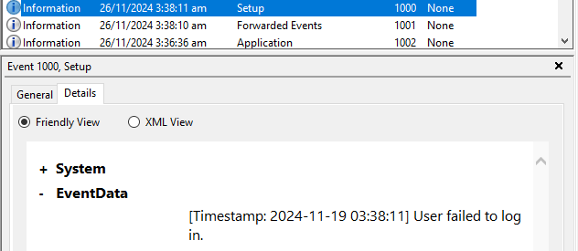

# ICT3215-Anti-Forensics-Tool (Forensics Disruptor)

## Introduction
*Forensics Disruptor* is an anti-forensics tool designed to disrupt digital forensic investigations by injecting false evidence, modifying logs, creating phantom files, and manipulating file metadata. This project provides a comprehensive set of features aimed at simulating real-world anti-forensics techniques for educational purposes.

This README will guide you through setting up and using *Forensics Disruptor* effectively.

---

## Features
1. **Log Forgery**:
   - Alters timestamps in logs using unique sources and events.
   - Injects fake user activities such as login, logout, file access, and system shutdown.
   - Automates masking of unauthorized actions with legitimate-looking entries.

2. **Phantom Files**:
   - Create hidden files in a folder of choice making it appear like somoene is trying to hide something there, wasting investigators' time.
   - Create empty, large fake files (sparse files).
   - Hides a file within another file using NTFS Alternate Data Streams (ADS).
   - Corrupts or lock a file via encryption.
   - Randomly assign fake extentions to a files in a folder.

3. **File Metadata Manipulation**:
   - Modify file attributes and timestamps.
   - Hide files in plain sight by altering their metadata.

4. **Cross-Platform Compatibility**:
   - Primarily supports Windows but includes some Linux-specific functionality.

## Prerequisites

### Supported Operating Systems
- **Windows 10 or higher** (Primary target).
- Limited functionality for **Linux-based systems**.

### Required Software
- **Python 3.8+** installed on your system. [Download Python](https://www.python.org/downloads/)
- Recommended: Git for cloning the repository. [Download Git](https://git-scm.com/downloads)

---

## Installation Guide

### Step 1: Clone the Repository
To begin, clone the repository to your local machine:
```bash
git clone https://github.com/yourusername/Forensics-Disruptor.git
cd Forensics-Disruptor
```
### Step 2: Create a Virtual Environment
Create and activate a virtual environment to manage dependencies:
```bash
# Create virtual environment
python -m venv venv

# Activate the virtual environment
# For Windows:
venv\Scripts\activate

# For Linux/Mac:
source venv/bin/activate
```
### Step 3: Install Dependencies
Install the required Python packages from `requirements.txt`:
```bash
pip install -r requirements.txt
```

## Usage

### Running the Application

The main GUI application can be started using:
```bash
python main.py
```

Once started, the GUI will provide buttons and options for all the features. For instance:

- Select folders/files for log forgery, phantom files, or metadata manipulation.
- Generate reports or evaluate the effectiveness of anti-forensics features.

## Compiling into an Executable

You can compile the application into a standalone executable using `build.py`:

```bash
python build.py
```
The resulting executable will be located in the `dist/` directory.

**Note:** The executable must be run as an administrator for certain features to work properly.


## File Descriptions

- `main.py`: The primary script that launches the GUI for the application. It integrates all features such as log forgery, phantom files, and metadata manipulation.
- `build.py`: Automates the process of creating a standalone executable using PyInstaller.
- `requirements.txt`: Lists all the dependencies required to run the project.

## Example Usage

**1. Log Forgery**

- Open the application.
- Select "Alter Timestamps" or "Inject Fake User Activity".
- Follow the prompts to specify the log details to modify.

**2. Phantom Files**
- Use options like "Create Phantom File" or "Create Sparse Files".
- Choose a target directory where the files will be created.

**3. File Metadata Manipulation**
- Select "Manipulate File Metadata" from the GUI.
- Provide the folder or file to alter, and the tool will apply changes.

# Screenshots
## Main Interface



## Log Forgery



---



# Future Enhancements
- Improved Linux support.
- In memory files.
- Additional GUI customization options.
- Expanded testing and evaluation features.